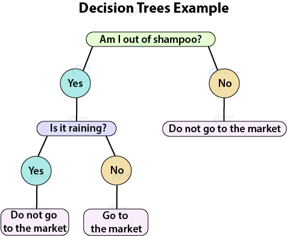

```{r setup, include=FALSE}
knitr::opts_chunk$set(echo = TRUE, fig.pos = 'H')
options(tinytex.verbose = TRUE)
library(kableExtra)
```
\pagebreak
# Preface {-}

This project is part of the capstone course for the Data Science Professional certificate series of courses made available through EdX by HarvardX^[https://www.edx.org/professional-certificate/harvardx-data-science].

The source code for the project along with the Rmarkdown report and PDF report are available on my [GitHub](https://github.com/cdsmithson/edx_capstone_fakenews).

# Introduction

Fake news! For the past several years it has become all too prevalent to encounter writings on the internet that are biased, misleading, or simply lies written with the goal of pushing a particular political narrative. The internet has become a cesspool of bad actors that wish to undermine the political processes of free nations all across the world. 

For the average person, some fake or misleading news articles can be difficult to recognize. Additionally, the average reader, at times, doesn't even research claims made in the article to assess their truthfulness. This can lead to extreme polarization among different political groups and rampant misinformation spreading across the internet like wildfire.

The purpose of this project is to explore how a fake news detection system can be built using data science techniques. We will be looking at data consisting of articles collected from the internet and labeled as either true news or fake news and seeing how we can use those articles to predict if a new, unseen, article is true or fake.

## Data Description

The data used in this project was made available by Kaggle^[https://www.kaggle.com/clmentbisaillon/fake-and-real-news-dataset]. Kaggle is an "online community of data scientists and machine learning practitioners. Kaggle allows users to find and publish data sets, explore and build models in a web-based data-science environment, work with other data scientists and machine learning engineers, and enter competitions to solve data science challenges" (Wikipedia)^[https://en.wikipedia.org/wiki/Kaggle]. The data consists of news articles that have either been flagged as fake or real.

## Evaluating our models

For each model we run, we will be measuring accuracy by calculating the F1 score from the predictions. Before we can begin to understand what the F1 score is, it is helpful to understand what some general terms mean, such as precision, recall, and accuracy.

**Precision** - Is the proportion of true positives among all predicted positives:

$$\text{Precision} = \frac{\text{True Positives}}{\text{(True Positives + False Positives)}}$$

**Recall** - Is the proportion of true positives among all actual positives:

$$\text{Recall} = \frac{\text{True Positives}}{\text{(True Positives + False Negatives)}}$$

**Accuracy** - Is the proportion of all correctly classified cases among all cases:

$$\text{Accuracy} = \frac{\text{True Positives + True Negatives}}{\text{(True Positives + False Positives + True Negatives + False Negatives)}}$$

**F1-Score** - Is the harmonic mean of Precision and Recall:

$$\text{F1-Score} = \left(\frac{\text{Recall}^{-1} + \text{Precision}^{-1}}{2}\right)^{-1} = 2 * \frac{(\text{Precision}*\text{Recall})}{(\text{Precision}+\text{Recall})}$$

The F1-score is our chosen evaluation metric because it has advantages over the simpler accuracy metric. The F1-score helps to penalize extreme values and helps assess accuracy when false negatives and false positives are important. In our case, we don't wont to incorrectly classify a fake news article as true and vice versa. Additionally, the F1-score is the preferable metric when dealing with imbalanced data and in this project there is an imbalance between fake and true news articles.

## Analysis approach

The general approach for this data science project was:  

1. Load the data:

The data used was downloaded from the Kaggle website. The data is a collection of news articles that have either been flagged as fake news or true news.

2. Analyze the data to understand structure, characteristics, and unique features:

In this step we will take a look at the data structure and features. Through this process, strategies for cleaning and preparing the data for machine learning modeling are developed.

3. Clean data and create the data partitions and structures needed for modeling:

During this step the data will be cleaned according to insights from the previous exploratory step. Additionally, we will need to create the `edx` and `validation` datasets and a `test_set` and `train_set` from the `edx` set. The `train_set` and `test_set` will be used for the initial model building. For the various classification algorithms that will be tested in the modeling steps we will need to tokenize (convert to individual words) the articles and calculate weightings for each word by using term frequency–inverse document frequency (tf-idf). Tf-idf is used to determine how important a word is in a collection of documents or corpus. We can easily calculate the tf-idf when creating the document term matrices necessary for modeling.

4. Create and evaluate models using insights gained from exploratory analysis;

Multiple models will be fit to the data and the model with the highest F1 score on the `test_set` will be selected as the final model. That model will then be retrained on the entire `edx` set and used to make predictions for the `validation` set.

# Analysis
## Load data

Below is the code used to import the raw data stored locally as two CSV files:

```{r warning=FALSE, message=FALSE, cache = TRUE}

###########
# Load Data
###########

repo <- "http://cran.us.r-project.org"

if(!require(tidyverse)) install.packages("tidyverse", repos = repo)
if(!require(tidytext)) install.packages("tidytext", repos = repo)
if(!require(stringr)) install.packages("stringr", repos = repo)
if(!require(caret)) install.packages("caret", repos = repo)
if(!require(xgboost)) install.packages("xgboost", repos = repo)
if(!require(ranger)) install.packages("ranger", repos = repo)
if(!require(tm)) install.packages("tm", repos = repo)
if(!require(ggplot2)) install.packages("ggplot2", repos = repo)
if(!require(tictoc)) install.packages("tictoc", repos = repo)
if(!require(kableExtra)) install.packages("kableExtra", repos = repo)
if(!require(knitr)) install.packages("knitr", repos = repo)

# Load fake news and true news datasets
fake_news <- read.csv("data/Fake.csv", 
                      stringsAsFactors = FALSE, 
                      encoding = "UTF-8")
true_news <- read.csv("data/True.csv", 
                      stringsAsFactors = FALSE, 
                      encoding = "UTF-8")

````

## Explore the data
### Fake News

As usual, we will begin our data exploration by taking a quick look at the structure of the data:

```{r warning=FALSE, message=FALSE, cache = TRUE}

# Check the structure of the fake news data
str(fake_news, vec.len = 0)

````

From the output we can see that there are 23,481 observations with 4 variables:

`title`, `text`, `subject`, and `date`

For the purposes of this project we are interested in the `title` and `text` variables so we will combine them together to form one new `text` variable. Additionally, we will add a flag for being fake news (1 represents that it is a fake news article):

```{r warning=FALSE, message=FALSE, cache = TRUE}

# Combine title and text and add fake news flag (1)
fake_news <- fake_news %>% 
  mutate(text = paste(title, text, sep = " "), fake = 1) %>% 
  select(text, fake)

````

Lets take a peek at the first entry of our new `text` variable:

```{r warning=FALSE, message=FALSE, cache = TRUE}

# Check first entry of new text variable
fake_news$text[1] %>% 
  knitr::kable(col.names = c("First entry from fake news")) %>% 
  kable_styling(latex_options=c("striped")) %>% 
  column_spec(1:1, color = "black", width = "39em") %>% 
  row_spec(0, color = "white", background = "#5a5cd6")

````

As we can see there is frequent use of colorful language such as "President Angry Pants" or "infantile gibberish". It is plain to see that this is a very opinionated author and article which is not very reliable. Reliable news would be objective, and present facts without much embellishment. Interestingly, it also includes lots of tweets from others in the article in an attempt to support the overarching narrative of the author. Additionally, there are instance where there is no space between numbers and the following word. This will be cleaned up later.

We can explore a little further by decomposing the text in to individuals tokens (words):

```{r warning=FALSE, message=FALSE, cache = TRUE}

# Check some of the words in the fake news articles
fake_news %>% 
  unnest_tokens(output = word, input = text) %>% 
  arrange(word) %>% 
  select(word) %>% 
  head(n = 10) %>% 
  knitr::kable() %>% 
  kable_styling(latex_options=c("scale_down", "striped")) %>% 
  column_spec(1:1, color = "black") %>% 
  row_spec(0, color = "white", background = "#5a5cd6")

````

Based on the output we can see that there are lots of underscores that will need to be cleaned up later.

Let's look at the individual words once more but this time we will sort them based on frequency. Additionally, we will remove stop words such as "the", "a", "to", etc...

```{r warning=FALSE, message=FALSE, cache = TRUE}

# Remove stop words and examine the 20 most common words in 
# the fake news articles
fake_news %>% 
  unnest_tokens(output = word, input = text) %>% 
  anti_join(stop_words) %>% 
  group_by(word) %>% 
  summarize(frequency = n()) %>% 
  arrange(desc(frequency)) %>% 
  head(n = 20) %>% 
  knitr::kable() %>% 
  kable_styling(latex_options=c("striped")) %>% 
  column_spec(1:2, color = "black") %>% 
  row_spec(0, color = "white", background = "#5a5cd6")

````

As we can see "trump" tops the list. Additionally, we see there are a significant amount of mentions for "obama", "clinton", "hillary", etc... Word frequencies will be integral to building a fake news detection system. Next we will turn our sights to the true news data.

### True News

As usual, we will begin our data exploration by taking a quick look at the structure of the data:

```{r warning=FALSE, message=FALSE, cache = TRUE}

# Check the structure of the true news data
str(true_news, vec.len = 0)

````

From the output we can see that there are 21,417 observations with 4 variables:

`title`, `text`, `subject`, and `date`

For the purposes of this project we are interested in the `title` and `text` variables so we will combine them together to form one new `text` variable. Additionally, we will add a flag for being true news (0 represents that it is a true news article):

```{r warning=FALSE, message=FALSE, cache = TRUE}

# Combine title and text and add true news flag (0)
true_news <- true_news %>% 
  mutate(text = paste(title, text, sep = " "), fake = 0) %>% 
  select(text, fake)

````

Lets take a peek at the first entry of our new `text` variable:

```{r warning=FALSE, message=FALSE, cache = TRUE}

# Check first entry of new text variable
substr(true_news$text[1], 1, 3500) %>% 
  knitr::kable(col.names = c("First entry from true news")) %>% 
  kable_styling(latex_options=c("striped")) %>% 
  column_spec(1:1, color = "black", width = "39em") %>% 
  row_spec(0, color = "white", background = "#5a5cd6")

````

As we can see there isn't frequent use of colorful language like there was in the fake news article we looked at before. This author seems to be presenting an objective narrative with facts to back it up and correct quotes and citations. The article also doesn't include lots of tweets from random people in an attempt to support the narrative. Additionally, there are not instances where there is no space between numbers and the following word or other typos. One thing worth noting is the string "WASHINGTON (Reuters)". We need to check to see if other entries have the same string or similar string present. We'll just extract the first 150 characters to see if the string in question is there.

```{r warning=FALSE, message=FALSE, cache = TRUE}

# Check next entry of new text variable
substr(true_news$text[2], 1, 150) %>% 
  knitr::kable(col.names = c("Next entry from true news")) %>% 
  kable_styling(latex_options=c("striped")) %>% 
  column_spec(1:1, color = "black", width = "39em") %>% 
  row_spec(0, color = "white", background = "#5a5cd6")

````

In fact, the string in question is present. Let's check the proportion of entries that have that string or something similar.

```{r warning=FALSE, message=FALSE, cache = TRUE}

# Check proportion of articles that contain "????(???? Reuters) - "
true_news %>% 
  filter(
    str_detect(
      text,
      paste0("[A-Z]\\(Reuters\\) -|[A-Z]\\s\\(Reuters\\) -|",
             "[A-Z]\\\\[A-Z]\\s\\(Reuters\\) -|\\(Reuters\\) -|",
             "[A-Z]\\sReuters\\) -|\\([A-Z]\\sReuters\\) -|Reuters"))) %>%
  summarise(perc_w_prefix = n())/nrow(true_news)

````

Just about 99% of the entries contain the string in question. This will need to be stripped from the entries to avoid biasing the models.

We can explore the true news a little further by decomposing the text in to individuals tokens (words):

```{r warning=FALSE, message=FALSE, cache = TRUE}

# Check some of the words in the true news articles
true_news %>% 
  unnest_tokens(output = word, input = text) %>% 
  arrange(word) %>% 
  select(word) %>% 
  head(n = 10) %>% 
  knitr::kable() %>% 
  kable_styling(latex_options=c("striped")) %>% 
  column_spec(1:1, color = "black") %>% 
  row_spec(0, color = "white", background = "#5a5cd6")

````

Based on the output we can see that there are lots of underscores that will need to be cleaned up later.

Let's look at the individual words once more but this time we will sort them based on frequency. Additionally, we will remove stop words such as "the", "a", "to", etc...

```{r warning=FALSE, message=FALSE, cache = TRUE}

# Remove stop words and examine the 20 most common words in 
# the true news articles
true_news %>% 
  unnest_tokens(output = word, input = text) %>% 
  anti_join(stop_words) %>% 
  group_by(word) %>% 
  summarize(frequency = n()) %>% 
  arrange(desc(frequency)) %>% 
  head(n = 20) %>% 
  knitr::kable() %>% 
  kable_styling(latex_options=c("striped")) %>% 
  column_spec(1:2, color = "black") %>% 
  row_spec(0, color = "white", background = "#5a5cd6")

````

As we can see "trump" tops the list again. However, unlike the fake news article we don't see a significant amount of mentions for "obama", "clinton", "hillary", etc... This makes sense because once an elected official is no longer in office they really aren't "news" anymore.

## Clean Data

Next, we will combine and clean the data. We combine the fake and true news datasets, create an arbitrary doc id, convert all text to lowercase, correct for no spacing between words and numbers, remove the string that we discovered was in almost 99% of the true news articles, delete extra spaces, and remove extra underscores. This gives us a mostly clean set of data to process further. In the next steps we will create our data partitions and document term matrices.

```{r warning=FALSE, message=FALSE, cache = TRUE}

# Combine fake and true news datasets, create doc id, 
# convert all text to lowercase, and do some general cleaning
news <- rbind(fake_news, true_news) %>% 
  # create arbitrary document id
  mutate(doc_id = seq(1, nrow(fake_news) + nrow(true_news), 1), 
         text = tolower(text)) %>% 
  # add space between numbers and words
  mutate(text = gsub("(?<=[0-9])(?=[a-z])", " ", text, perl = TRUE)) %>% 
  # strip the "reuters" tags in all its forms from the text
  mutate(
    text = gsub(
      paste0("[a-a]\\(reuters\\) -|[a-z]\\s\\(reuters\\) -|",
             "[a-z]\\\\[a-z]\\s\\(reuters\\) -|\\(reuters\\) -|",
             "[a-z]\\sreuters\\) -|\\([a-z]\\sreuters\\) -|reuters"),
      "", text, perl = TRUE)) %>%
  # remove excess spaces
  mutate(text = gsub("\\s+", " ", text, perl = TRUE)) %>% 
  # remove excess underscores
  mutate(text = gsub("_+", " ", text, perl = TRUE)) %>% 
  select(doc_id, text, fake)

````

## Create Data Partitions

Here we create the `edx`, `validation`, `train_set`, and `test_set` data sets. All splits are 80/20.

```{r warning=FALSE, message=FALSE, cache = TRUE}

# Validation set will be 20% of combined news data
set.seed(1, sample.kind="Rounding")
test_index <- createDataPartition(
  y = news$fake, times = 1, p = 0.2, list = FALSE)
edx <- news[-test_index,]
validation <- news[test_index,]

# Create test and train sets from edx set with an 80/20 split
set.seed(1, sample.kind="Rounding")
test_index <- createDataPartition(
  y = edx$fake, times = 1, p = 0.2, list = FALSE)
train_set <- edx[-test_index,]
test_set <- edx[test_index,]

# Remove unused data objects
rm(fake_news, true_news, news, test_index)

gc()

````

## Create Document Term Matrices

In order to structure the data properly for machine learning some transformations must be done first. We begin by tokenizing the text bodies, removing numbers and stop words, and stemming the words. Stemming is the process of reducing a word down in to essentially its "root". For example, all the words "friendly", "friends", "friendliness" would be reduced down to "friend". This cuts down significantly on the number of features used in the models. 

Next, these newly created dataframes are converted to document term matrices. A document term matrix (DTM) is a matrix consisting of the document id/name in the rows and words/tokens in the columns. The value at the intersection of the rows and columns is the tf-idf. Tf-idf is used to determine how important a word is in a collection of documents or corpus. While creating the DTMs, we also remove sparse terms. For this project we remove any term (word) that is only present in 1% or less of the documents. 

Now, we will ensure that the same terms are in the `edx` and `validation` datasets and the `train_set` and `test_set` datasets. 

Lastly, in an effort to save memory, we will save some data objects to a new sub-directory "RDS" in the working directory and delete the objects from our R session. Additionally, we will use the garbage collection function `gc()` to ensure we get rid of anything lingering in memory.

```{r warning=FALSE, message=FALSE, cache = TRUE}

# Create tidy token dataframes
edx_tokens <- edx %>% 
  unnest_tokens(output = word, input = text) %>% 
  filter(!str_detect(word, "^[0-9]*$")) %>%
  anti_join(stop_words) %>% 
  mutate(word = SnowballC::wordStem(word))

validation_tokens <- validation %>% 
  unnest_tokens(output = word, input = text) %>% 
  filter(!str_detect(word, "^[0-9]*$")) %>%
  anti_join(stop_words) %>% 
  mutate(word = SnowballC::wordStem(word))

train_set_tokens <- train_set %>% 
  unnest_tokens(output = word, input = text) %>% 
  filter(!str_detect(word, "^[0-9]*$")) %>%
  anti_join(stop_words) %>% 
  mutate(word = SnowballC::wordStem(word))

test_set_tokens <- test_set %>% 
  unnest_tokens(output = word, input = text) %>% 
  filter(!str_detect(word, "^[0-9]*$")) %>%
  anti_join(stop_words) %>% 
  mutate(word = SnowballC::wordStem(word))

# Create Document Term Matrices
edx_dtm <- edx_tokens %>% 
  count(doc_id, word) %>% 
  cast_dtm(document = doc_id, term = word, value = n,
           weighting = tm::weightTfIdf) %>% 
  removeSparseTerms(sparse = .99)

validation_dtm <- validation_tokens %>% 
  count(doc_id, word) %>% 
  cast_dtm(document = doc_id, term = word, value = n,
           weighting = tm::weightTfIdf) %>% 
  removeSparseTerms(sparse = .99)

train_set_dtm <- train_set_tokens %>% 
  count(doc_id, word) %>% 
  cast_dtm(document = doc_id, term = word, value = n,
           weighting = tm::weightTfIdf) %>% 
  removeSparseTerms(sparse = .99)

test_set_dtm <- test_set_tokens %>% 
  count(doc_id, word) %>% 
  cast_dtm(document = doc_id, term = word, value = n,
           weighting = tm::weightTfIdf) %>% 
  removeSparseTerms(sparse = .99)

# Ensure same terms are in both edx and validation document term matrices
edx_dtm <- edx_dtm[, intersect(
  colnames(edx_dtm), colnames(validation_dtm))]
validation_dtm <- validation_dtm[, intersect(
  colnames(validation_dtm), colnames(edx_dtm))]

# Ensure same terms are in both train and test document term matrices
train_set_dtm <- train_set_dtm[, intersect(
  colnames(train_set_dtm), colnames(test_set_dtm))]
test_set_dtm <- test_set_dtm[, intersect(
  colnames(test_set_dtm), colnames(train_set_dtm))]

# Create folder in the wd to save RDS files 
# if it doesn't already exist
if(dir.exists("RDS") == FALSE){dir.create("RDS")}

# Save some objects to free up memory
saveRDS(edx, file = "RDS/edx.RDS")
saveRDS(validation, file = "RDS/validation.RDS")
saveRDS(edx_dtm, file = "RDS/edx_dtm.RDS")
saveRDS(validation_dtm, file = "RDS/validation_dtm.RDS")
saveRDS(edx_tokens, file = "RDS/edx_tokens.RDS")
saveRDS(validation_tokens, file = "RDS/validation_tokens.RDS")
saveRDS(test_set_tokens, file = "RDS/test_set_tokens.RDS")
saveRDS(train_set_tokens, file = "RDS/train_set_tokens.RDS")

# Remove some objects to free up memory
rm(edx, validation, edx_dtm, validation_dtm)
rm(edx_tokens, validation_tokens)
rm(test_set_tokens, train_set_tokens)

gc()

````

## Modeling Approach

For the modeling process, we will look at three popular methods for performing classification. These popular methods are random forest (RF), support vector machines (SVM), and extreme gradient boosting (XGB). 

### Random Forest

Random forest techniques have been around for quite some time, are easy to implement, and provide pretty good results for a lot of cases. The basic concept of random forest traces its roots (pun very much intended) back to classic binomial decision trees. In figure 2.1 we can see a simple version of a decision tree to decide if you should go to the store or not.

```{r warning=FALSE, echo=FALSE, out.width='40%', cache=TRUE, fig.cap="Source: https://data-flair.training/blogs/r-decision-trees/", fig.align="center"}

````

"Am I out of shampoo?" is the root node and depending on the answer to that question will inform you which branch to traverse next. If the answer is "Yes" then you go down the left branch to the next decision node "Is it raining?" If it is raining, you don't go, but if it's not raining you go. These final nodes that give us our final outcome are called terminal nodes. In practice, decision trees for classification of data are much, much more complex and the number of different branches can be very large. When optimizing a decision tree we are trying to figure out the best way of constructing the branch and decision nodes to get us to the correct terminal node the most.

Where random forests differ from a single decision trees is, you guessed it, it uses a whole bunch of trees. The basic premise is that any one tree can be wrong in some way, but if you take a whole bunch of uncorrelated trees, then they are likely not all wrong in the same manner. The uncorrelated part is very important. If the trees were highly correlated then they would all err the same way and it would be a waste of time because no accuracy improvement would be gained. Once the forest is grown, you take the ensemble of predictions to get the final prediction. You can liken this to the "wisdom of the crowd".

Next, we will explore on a high level what makes a support vector machine.

### Support Vector Machine

Support vector machines have been another popular method for classification, and regression, for quite some time as well. The concept of support vector machines is to find a hyperplane that best divides the data in to its respective group that has the largest margin between the hyperplane and the nearest data points.

```{r warning=FALSE, echo=FALSE, out.width='50%', cache=TRUE, fig.cap="Source: https://www.kdnuggets.com/2016/07/support-vector-machines-simple-explanation.html", fig.align="center"}
include_graphics("images/2d_plane.png")
````

In real life, classifications problems rarely live in a simple two dimensional space. What if we have a higher dimensional dataset similar to what is illustrated in figure 2.3?

```{r warning=FALSE, echo=FALSE, out.width='50%', cache=TRUE, fig.cap="Source: https://www.kdnuggets.com/2016/07/support-vector-machines-simple-explanation.html", fig.align="center"}
include_graphics("images/data_3d_plane.png")
````

For this data we would have to include the third dimension when establishing the hyperplane that best divides the data (see figure 2.4).

```{r warning=FALSE, echo=FALSE, out.width='50%', cache=TRUE, fig.cap="Source: https://www.kdnuggets.com/2016/07/support-vector-machines-simple-explanation.html", fig.align="center"}
include_graphics("images/3d_plane.png")
````

Anything beyond 3 dimension and we can't even represent it visually. This is where machine learning comes in to save the day!

### Extreme Gradient Boosting

Extreme gradient boosting (XGB) has regularly beat the competition when it comes to small to medium, structured data, and supervised learning. One can think of XGB as random forest but on steroids. The math behind gradient descent is beyond the scope of this writing, and I'm still trying to fully understand it, but the main point is that its pretty awesome. Some other, more easily explainable, benefits of XGB are:

1. Parallelized computing
2. Better tree pruning
3. Hardware optimization
4. Built-in regularization
5. Better handling of sparsity
6. Weighted quantile sketch (finding optimal splits)
7. Built-in cross-validation

# Results
## Random Forest
```{r warning=FALSE, message=FALSE, cache=TRUE}

####################################### Random Forest Model

tic()
set.seed(1, sample.kind="Rounding")

# Train Random Forest Model
train_rf <- ranger(fake_flag ~ .,
                   data = data.frame(fake_flag = as.factor(train_set$fake), 
                                         as.matrix(train_set_dtm)),
                   num.trees = 100,
                   classification = TRUE,
                   verbose = FALSE)

toc()

# Make predictions on test set
pred_rf <- predict(train_rf, data = data.frame(as.matrix(test_set_dtm)))

# calculate confusion matrix
cm_rf <- confusionMatrix(pred_rf$predictions, as.factor(test_set$fake))

# Store F1 score
F1_rf <- round(cm_rf[["byClass"]][["F1"]], 5)

accuracy_results <- tibble(Method = "Random Forest",
                           F1_Score = F1_rf)

accuracy_results %>% knitr::kable() %>% 
  kable_styling(latex_options=c("striped")) %>% 
  column_spec(1:2, color = "black") %>% 
  row_spec(0, color = "white", background = "#5a5cd6")

````

As we can see the random forest model performed pretty well with an F1-score of ``r F1_rf``. We will use this as our baseline accuracy metric for evaluating subsequent models.

## Support Vector Machine
```{r warning=FALSE, message=FALSE, cache=TRUE}

####################################### Support Vector Machine

tic()
set.seed(1, sample.kind="Rounding")
train_svm <- train(x = as.matrix(train_set_dtm),
                   y = as.factor(train_set$fake),
                   method = "svmLinearWeights2")
toc()

col_order <- colnames(train_set_dtm) 

# Make predictions on test set
pred_svm <- predict(train_svm, as.matrix(test_set_dtm)[, col_order])

# calculate confusion matrix
cm_svm <- confusionMatrix(pred_svm, as.factor(test_set$fake))

# Store F1 score
F1_svm <- round(cm_svm[["byClass"]][["F1"]], 5)

accuracy_results <- bind_rows(accuracy_results,
                              tibble(Method = "Support Vector Machine",
                                     F1_Score = F1_svm))

accuracy_results %>% knitr::kable() %>% 
  kable_styling(latex_options=c("striped")) %>% 
  column_spec(1:2, color = "black") %>% 
  row_spec(0, color = "white", background = "#5a5cd6")

````

Although we got an F1-score of ``r F1_svm`` it was not an improvement over our baseline random forest model. Next we will see how XGB measures up against the first two models.

## Extreme Gradient Boosting
```{r warning=FALSE, message=FALSE, cache=TRUE}

####################################### Extreme Gradient Boosting

tic()
set.seed(1, sample.kind="Rounding")
train_xgb <- xgboost(data = as.matrix(train_set_dtm), 
                     label = train_set$fake, 
                     nrounds = 100,
                     eta = 0.3, 
                     gamma = 0, 
                     max_depth = 6, 
                     min_child_weight = 1, 
                     subsample = 1, 
                     colsample_bytree = 1,
                     eval_metric = "error",
                     objective = "binary:logistic",
                     nthread = 3,
                     verbose = 0) 
toc()

col_order <- colnames(train_set_dtm)

# Make predictions on test set
pred_xgb <- predict(train_xgb, as.matrix(test_set_dtm)[, col_order])

# if predicted value > 0.5 then its a 1 (fake news) otherwise its not fake news
pred_xgb <- ifelse(pred_xgb > 0.5, 1, 0)

# calculate confusion matrix
cm_xgb <- confusionMatrix(factor(pred_xgb), factor(test_set$fake))

# Store F1 score
F1_xgb <- round(cm_xgb[["byClass"]][["F1"]], 5)

accuracy_results <- bind_rows(accuracy_results,
                              tibble(Method = "XGB",
                                     F1_Score = F1_xgb))

accuracy_results %>% knitr::kable() %>% 
  kable_styling(latex_options=c("striped")) %>% 
  column_spec(1:2, color = "black") %>% 
  row_spec(0, color = "white", background = "#5a5cd6")

````

Based on the results we can see that XGB was the best performing model thus far with a F1-score of ``r F1_xgb``. Extreme gradient boosting will be selected as the final model.

## Evaluation of final model
```{r warning=FALSE, message=FALSE, cache=TRUE}

####################################### Extreme Gradient Boosting Final Model

# remove some objects to conserve memory
rm(test_set, train_set, test_set_dtm, train_set_dtm)

# load in the data save previously for model
edx <- readRDS(file = "RDS/edx.RDS")
validation <- readRDS(file = "RDS/validation.RDS")
edx_dtm <- readRDS(file = "RDS/edx_dtm.RDS")
validation_dtm <- readRDS(file = "RDS/validation_dtm.RDS")

tic()
set.seed(1, sample.kind="Rounding")
train_xgb_final <- xgboost(data = as.matrix(edx_dtm), 
                     label = edx$fake, 
                     nrounds = 100,
                     eta = 0.3, 
                     gamma = 0, 
                     max_depth = 6, 
                     min_child_weight = 1, 
                     subsample = 1, 
                     colsample_bytree = 1,
                     eval_metric = "error",
                     objective = "binary:logistic",
                     nthread = 3,
                     verbose = 0)
toc()

col_order <- colnames(edx_dtm)

# predict on validation set
pred_xgb_final <- predict(train_xgb_final, as.matrix(validation_dtm)[, col_order])

# if predicted value > 0.5 then its a 1 (fake news) otherwise its not fake news
pred_xgb_final <- ifelse(pred_xgb_final > 0.5, 1, 0)

# calculate confusion matrix
cm_xgb_final <- confusionMatrix(factor(pred_xgb_final), factor(validation$fake))

# Store F1 score
F1_xgb_final <- round(cm_xgb_final[["byClass"]][["F1"]], 5)

accuracy_results <- bind_rows(accuracy_results,
                              tibble(Method = "XGB_final",
                                     F1_Score = F1_xgb_final))

accuracy_results %>% knitr::kable() %>% 
  kable_styling(latex_options=c("striped")) %>% 
  column_spec(1:2, color = "black") %>% 
  row_spec(0, color = "white", background = "#5a5cd6")

````

Our final XGB model performs pretty well even though we are just using default tuning parameters. The final F1-score came in at ``r F1_xgb_final`` which is higher than the F1-score in the model exploration phase.

# Conclusion

Building a fake news detection system has been both challenging and rewarding. I've had to push myself to learn new techniques and methods especially when dealing with text data on a large scale. By testing multiple different methodologies we got a good sense of how some algorithms perform better than others when it comes to text classification. For this use case, extreme gradient boosting was the best performing model out of the three, but random forest held it's own too. By using extreme gradient boosting we were able to get a final F1-score of ``r F1_xgb_final``. Some limitations on this work is the lack of hyper-parameter optimization. To get the most accurate model possible, one would need to do more tuning to find the optimal hyper-parameter values. I will continue to work on tuning the XGB model to improve accuracy. Overall, I am very satisfied with the final results achieved.
